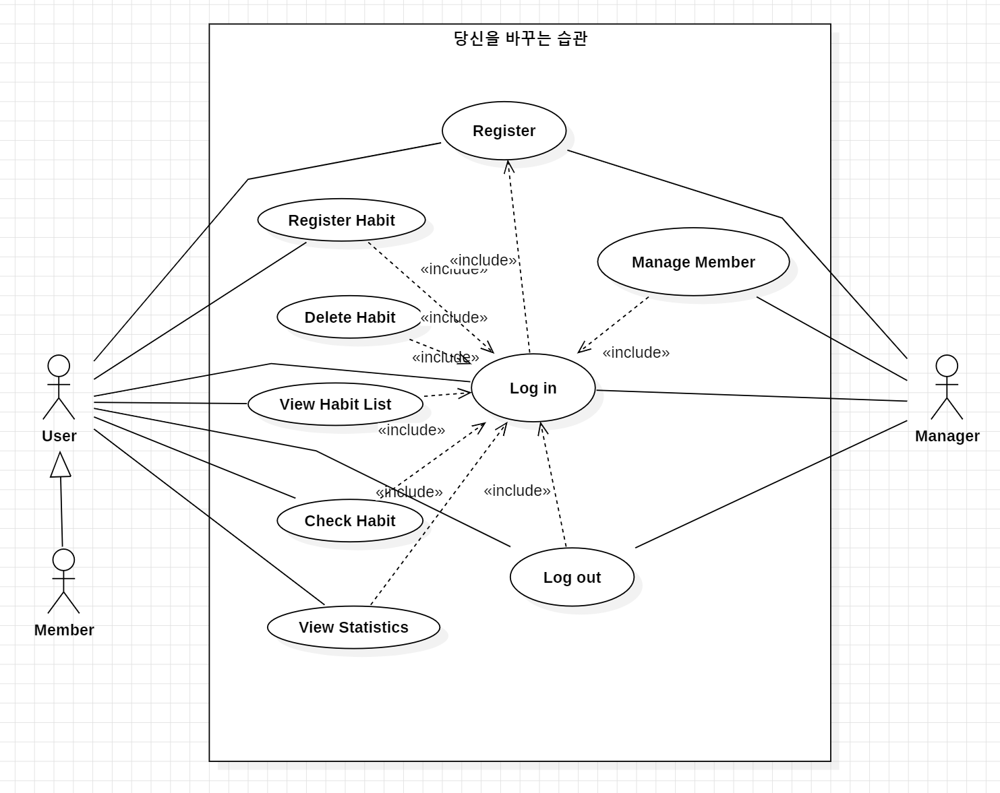

# 당신을 바꾸는 습관

# 2. Analysis

Student No: 22421575

Name: 신지예

E-mail: sinjiye0506@naver.com

## Revision history
|Revision date|Version #|Description|Author|
|------|---|-------|------|
|||||

---

## Contents

### 1. Introduction
### 2. Use case analysis
### 3. Domain analysis
### 4. User Interface prototype
### 5. Glossary
### 6. References

---

## 1. Introduction

### 1) Summary
현대 사회에서 많은 사람들을 자기계발을 위해 다양한 습관을 형성하려고 노력한다. 하지만 습관을 지속적으로 유지하고 관리하는 것은 쉽지 않으며, 이를 체계적으로 쉽게 기록하고 분석하는 도구가 부족한 경우도 있다. 이에 따라 본 프로젝트에서는 사용자가 자신의 습관을 등록하고, 수행 여부를 기록하며, 이를 기반으로 통계를 확인할 수 있는 '당신을 바꾸는 습관'을 개발하고자 한다.

### 2) Goals
'당신을 바꾸는 습관'은 사용자의 습관 형성을 돕는 것이 목적이다. 꾸준히 실행할 수 있도록 통계를 보여주며 동기를 부여해준다. 다양한 사용자들이 사용하기 쉬운 인터페이스로 진입장벽은 낮추고 사용자들의 만족도는 높일 것이다.

---

## 2. Use case analysis

### 1) Use case diagram

### 2) Use case description

Use Case #1 : Register member

GENERAL CHARACTERISTICS
|Summary|사용자가 이 시스템을 처음 사용할 때 사용한다.|
|-------|-----------------------------|
|Scope|당신을 바꾸는 습관|
|Level|User Level|
|Author|신지예|
|Last Update|2026-04-29|
|Status|Analysis|
|Primary Actor|User, Manager|
|Preconditions|시스템이 실행되어 있어야 한다.|
|Trigger|메인 화면에서 회원가입 버튼을 누른 경우|
|Success Post Condition|회원가입이 완료되어 로그인 창이 뜬다.|
|Failed Post Condidtion|회원가입이 되지 않는다.|

MAIN SUCCESS SCENARIO
|Step|Action|
|-------|----------------------------|
|1|사용자가 회원가입 버튼을 누른다.|
|2|ID와 PW를 적는 창이 뜬다.|
|3|사용자가 ID와 PW를 기입한다.|
|4|회원 가입이 완료되어 로그인 창으로 이동한다.|

EXTENSION SCENARIO
|Step|Branching Action|
|--------|---------------------------|
|3|3a. 기입한 아이디가 이미 존재하는 경우|
||3a.1. 이미 존재하는 아이디라는 메세지를 띄워준다.|
||3a.2 ID와 PW를 입력하는 페이지로 돌아간다.|
||3b. ID와 PW를 입력하지 않은 경우|
||3b.1. ID 또는 PW가 입력되지 않았다는 메세지를 띄워준다.|
||3b.2. ID와 PW를 입력하는 페이지도 돌아간다.|

RELATED INFORMATION
|Performance|< 3Seconds|
|----------|------------------------|
|Frequency|Variable|
|Concurrency|None|
|Due Date|2026-05-01|

Use Case #2 : Log in

GENERAL CHARACTERISTICS
|Summary|시스템의 기능들을 사용하기 위해 회원 인증을 받을 때 사용한다.|
|-------|-----------------------------|
|Scope|당신을 바꾸는 습관|
|Level|User Level|
|Author|신지예|
|Last Update|2026-04-29|
|Status|Analysis|
|Primary Actor|User, Manager|
|Preconditions|시스템이 실행되어 있어야 한다. 그리고 회원가입이 되어있어야 한다.|
|Trigger|로그인 버튼을 누른다.|
|Success Post Condition|저장되어 있는 회원임이 인증되어서 시스템을 사용할 수 있다.|
|Failed Post Condidtion|로그인 실패 메세지가 출력되고 로그인 창으로 돌아간다.|

MAIN SUCCESS SCENARIO
|Step|Action|
|-------|----------------------------|
|1|사용자가 등록된 ID와 PW를 입력한다.|
|2|사용자가 로그인 버튼을 누른다.|
|3|시스템이 데이터베이스와 대조하여 일치함을 확인한다.|
|4|시스템이 해당 사용자의 데이터를 불러온다.|
|5|메인 화면이 출력된다.|

EXTENSION SCENARIO
|Step|Branching Action|
|--------|---------------------------|
|3|3a. 입력한 ID가 존재하지 않거나 PW가 일치하지 않는 경우|
||3a.1. ID 또는 PW가 틀렸는다 메세지를 띄운다.|
||3a.2. 로그인 페이지로 돌아간다.|

RELATED INFORMATION
|Performance|<2Seconds|
|----------|------------------------|
|Frequency|Daily|
|Concurrency|None|
|Due Date|2026-05-01|

Use Case #3 : Log out

GENERAL CHARACTERISTICS
|Summary|현재 사용자의 세션을 종료하고 시스템 사용을 마친다.|
|-------|-----------------------------|
|Scope|당신을 바꾸는 습관|
|Level|User Level|
|Author|신지예|
|Last Update|2026-04-29|
|Status|Analysis|
|Primary Actor|User, Maneger|
|Preconditions|사용자가 로그인이 된 상태여야 한다.|
|Trigger|로그아웃 버튼을 클릭한다.|
|Success Post Condition|현재 데이터가 안전하게 저장되고 로그인 화면으로 돌아간다.|
|Failed Post Condidtion|로그아웃 처리 되지 않고 현재 화면이 유지된다.|

MAIN SUCCESS SCENARIO
|Step|Action|
|-------|----------------------------|
|1|사용자가 로그아웃 버튼을 누른다.|
|2|시스템이 현재까지의 변경사항을 저장한다.|
|3|시스템이 사용자 세션을 종료한다.|
|4|로그인 화면으로 이동한다.

EXTENSION SCENARIO
|Step|Branching Action|
|--------|---------------------------|
|2|2a. 데이터 저장 과정에서 오류가 발생한 경우|
||2a.1. 데이터 저장 중 오류가 발생했다는 메세지를 띄운다.|

RELATED INFORMATION
|Performance|<1Second|
|----------|------------------------|
|Frequency|Variable|
|Concurrency|None|
|Due Date|2026-05-01|

Use Case #4 : Register Habit

GENERAL CHARACTERISTICS
|Summary|사용자가 실천하고자 하는 새로운 습관 항목을 추가한다.|
|-------|-----------------------------|
|Scope|당신을 바꾸는 습관|
|Level|User Level|
|Author|신지예|
|Last Update|2026-04-29|
|Status|Analysis|
|Primary Actor|User|
|Preconditions|사용자가 로그인이 된 상태여야 한다.|
|Trigger|습관 관리 화면에서 '습관 추가'버튼을 누른다.|
|Success Post Condition|새로운 습관이 리스트에 추가되고 화면에 표시된다.|
|Failed Post Condidtion|습관 추가가 취소되거나 오류 메세지가 뜬다.|

MAIN SUCCESS SCENARIO
|Step|Action|
|-------|----------------------------|
|1|사용자가 습관 이름과 상세 설명을 입력한다.|
|2|사용자가 저장 버튼을 누른다.|
|3|시스템이 입력값의 유효성을 검사한다.|
|4|습관 목록 객체에 새로운 데이터를 추가한다.|

EXTENSION SCENARIO
|Step|Branching Action|
|--------|---------------------------|
|3|3a. 존재하는 습관과 이름이 동일한 경우|
||3a.1. 동일한 이름이 이미 존재한다는 메세지를 띄운다.|
||3b. 이름이 비어있는 경우|
||3b.1. 습관 이름을 입력해달라는 메세지를 띄운다.|

RELATED INFORMATION
|Performance|<2Seconds|
|----------|------------------------|
|Frequency|None|
|Concurrency|None|
|Due Date|2026-05-01|

Use Case #5 : Delete Habit

GENERAL CHARACTERISTICS
|Summary|등록된 습관 중 더 이상 기록할 필요가 없는 항목을 제거한다.|
|-------|-----------------------------|
|Scope|당신을 바꾸는 습관|
|Level|User Level|
|Author|신지예|
|Last Update|2026-04-29|
|Status|Analysis|
|Primary Actor|User|
|Preconditions|사용자가 로그인 상태이며, 삭제하고자 하는 습관이 목록에 존재해야 한다.|
|Trigger|삭제 버튼을 누른다.|
|Success Post Condition|해당 습관 정보와 그동안의 수행 기록 데이터가 시스템에서 제거된다.|
|Failed Post Condidtion|데이터가 삭제되지 않고 기존 목록이 그대로 유지된다.|

MAIN SUCCESS SCENARIO
|Step|Action|
|-------|----------------------------|
|1|사용자가 삭제버튼을 누른다.|
|2|삭제하고싶은 습관 항목을 선택한다.|
|3|삭제 버튼을 누르면 정말 삭제하시겠습니까라는 메세지를 출력한다.|
|4|사용자가 예 버튼을 누른다.|
|5|시스템이 데이터베이스에서 해당 습관 관련 정보를 삭제한다.|
|6| 시스템이 갱신된 습관 목록을 다시 불러와 화면에 표시한다.|

EXTENSION SCENARIO
|Step|Branching Action|
|--------|---------------------------|
|4|4a. 사용자가 확인 메세지에서 아니오를 선택한 경우|
||4a.1. 삭제 처리를 중단하고 팝업창을 닫으며 메인 화면으로 돌아간다.|

RELATED INFORMATION
|Performance|<1Second|
|----------|------------------------|
|Frequency|Low|
|Concurrency|None|
|Due Date|2026-05-01|

Use Case #6 : View Habit List

GENERAL CHARACTERISTICS
|Summary|사용자가 현재 실천중인 모든 습관의 목록과 오늘 수행 여부를 한눈에 확인한다.|
|-------|-----------------------------|
|Scope|당신을 바꾸는 습관|
|Level|User Level|
|Author|신지예|
|Last Update|2026-04-29|
|Status|Analysis|
|Primary Actor|User|
|Preconditions|사용자가 시스템에 로그인되어 있어야 한다.|
|Trigger|로그인 직후 메인 대시보드에 진입하거나, 다른 메뉴에서 메인 화면으로 돌아올 때 실행된다.|
|Success Post Condition|등록된 모든 습관의 이름, 간단한 설명, 오늘의 체크 상태가 화면에 출력된다.|
|Failed Post Condidtion|목록을 불러오는데 실패했다는 에러 메세지가 표시되거나 빈 화면이 나타난다.|

MAIN SUCCESS SCENARIO
|Step|Action|
|-------|----------------------------|
|1|시스템이 현재 로그인된 사용자의 ID를 식별한다.|
|2|시스템이 저장소로부터 해당 사용자의 습관 데이터를 읽어온다.|
|3|시스템이 오늘 날짜를 기준으로 각 습관의 수행 여부를 조회한다.|
|4|시스템이 습관 목록을 리스트 형태의 UI로 구성하여 화면에 렌더링한다.|

EXTENSION SCENARIO
|Step|Branching Action|
|--------|---------------------------|
|2|2a. 등록된 습관 데이터가 하나도 없는 신규 사용자인 경우|
||등록된 문구가 없다는 안내 문구를 대신 표시한다.|

RELATED INFORMATION
|Performance|<2Seconds|
|----------|------------------------|
|Frequency|High|
|Concurrency|None|
|Due Date|2026-05-01|

Use Case #7 : Check Habit

GENERAL CHARACTERISTICS
|Summary|오늘 실행한 습관에 체크를 한다.|
|-------|-----------------------------|
|Scope|당신을 바꾸는 습관 |
|Level|User Level|
|Author|신지예|
|Last Update|2026-04-29|
|Status|Analysis|
|Primary Actor|User|
|Preconditions|로그인 상태이며, 등록된 습관 목록이 화면에 출력되어야 한다.|
|Trigger|습관 항목 옆의 체크박스를 클릭한다.|
|Success Post Condition|해당 날짜의 수행기록이 업데이트되고 연속 성공일이 갱신된다.|
|Failed Post Condidtion|체크 상태가 반영되지 않는다|

MAIN SUCCESS SCENARIO
|Step|Action|
|-------|----------------------------|
|1|사용자가 완료한 습관의 체크박스를 누른다.|
|2|시스템이 해당 습관의 오늘 날짜 완료 상태를 True로 변경한다.|
|3|시스템이 해당 습관의 연속 성공일을 계산하여 1 증가시킨다.|
|4|화면에 체크표시가 유지된다.|

EXTENSION SCENARIO
|Step|Branching Action|
|--------|---------------------------|
|1|1a. 이미 체크된 항목을 다시 클릭한 경우|
||1a.1. 수행 기록을 False로 변경하고 연속 성공일을 재계산한다.|

RELATED INFORMATION
|Performance|<3Seconds|
|----------|------------------------|
|Frequency|None|
|Concurrency|None|
|Due Date|2026-05-01|

Use Case #8 : View Statistics

GENERAL CHARACTERISTICS
|Summary|사용자의 습관 달성률 및 성과 데이터를 시각화하여 보여준다.|
|-------|-----------------------------|
|Scope|당신을 바꾸는 습관|
|Level|User Level|
|Author|신지예|
|Last Update|2026-04-29|
|Status|Analysis|
|Primary Actor|User|
|Preconditions|수행 기록 데이터가 존재해야 한다.|
|Trigger|메뉴에서 분석 버튼을 누른다.|
|Success Post Condition|달성률 그래프와 최대 연속 성공일 등의 수치가 출력된다.|
|Failed Post Condidtion|데이터가 없거나 분석 오류 메세지가 뜬다.|

MAIN SUCCESS SCENARIO
|Step|Action|
|-------|----------------------------|
|1|사용자가 분석 버튼을 누른다.|
|2|시스템이 전체 기록 데이터를 기반으로 습관별 달성률을 계산한다.|
|3|시스템이 최대 연속 성공일을 추출한다.|
|4|계산된 수치를 그래프나 텍스트 형식으로 화면에 출력한다.|

EXTENSION SCENARIO
|Step|Branching Action|
|--------|---------------------------|
|2|2a. 달성률 계산에 실패할 경우|
||2a.1. 달성률 계산에 실패했다는 메세지를 띄운다.|
||2a.2. 메인 화면으로 돌아간다.|
|3|3a. 연속 성공일 추출에 실패할 경우|
||3a.1. 연속 성공일 추출에 실패했다는 메세지를 띄운다.|
||3a.2. 메인 화면으로 돌아간다.|

RELATED INFORMATION
|Performance|<3Seconds|
|----------|------------------------|
|Frequency|None|
|Concurrency|None|
|Due Date|2026-05-01|

---

## 3. Domain analysis

1)User
사용자 클래스다. Memder와 Manager가 공통으로 갖는 요소들(ID, PW, 닉네임 등)을 정의하는 클래스이다.

2) Member
멤버 클래스다. 사용자의 기능들을 사용할 수 있고 그 외에 습관을 관리하는 기능들도 사용할 수 있는 클래스이다.

4) Manager
관리자 클래스다. 사용자의 기능들을 사용할 수 있고 추가로 멤버를 관리하는 기능도 사용할 수 있는 클래스이다.

5) Login
로그인 클래스다. 시스템을 사용 가능하게 해주는 클래스이다. 시스템에 접근하는 사용자가 누구인지 판별하고 그 결과를 시스템에 알려준다.

7) Database
데이터베이스 클래스다. 유일하게 사용자 데이터에 접근할 수 있는 클래스이다.

9) Habits
습관 클래스다. 사용자가 관리하는 습관에 대한 클래스이다.

11) Record
수행 기록 클래스다. 각 습관을 언제 수행했는지에 대한 데이터를 저장하는 클래스이다.

12) Show_List
조회 클래스다. 현재 있는 습관들을 띄워주는 클래스이다.

14) Statistics
분석 클래스다. 습관들의 달성률과 연속 성공일을 보여주는 클래스이다.

15) MAIN
메인 클래스다. 시스템의 모든 과정이 시행되는 클래스이다.

## 4. User Interface prototype

## 5. Glossary

메인 화면: 시스템에 처음 접속하였을 때 볼 수 있는 화면이다. 습관 리스트를 볼 수 있다.
데이터베이스: 사용자들의 회원 정보와 습관 데이터들이 저장되어 있는 곳이다.

## 6. References

Analysis with examples 파일

