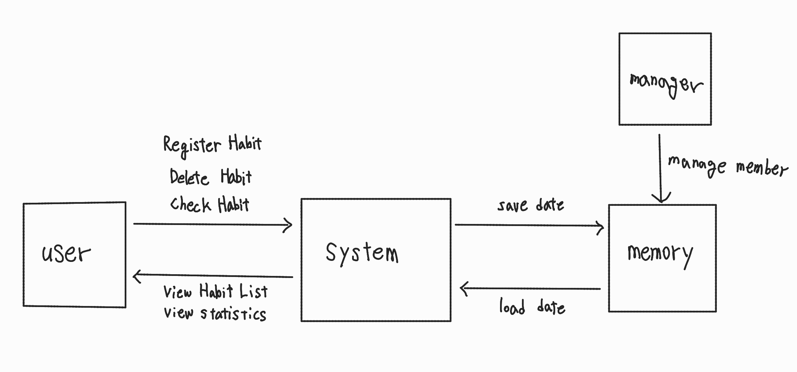

# 당신을 바꾸는 습관

# 1. Conceptualization

Student NO: 22421575

Name: 신지예

E-mail: sinjiye0506@naver.com

깃허브: https://github.com/sinjiye/Habit-Tracker

---
## Revision history

| Revision data | Version | Descrption | Author| 
| :------: | :---: | :------: | :------: |
| 3/27/2026 | 1.00 | 초안 | 신지예 |
| 4/28/2026 | 1.01 | 오타 수정, 목차 추가 | 신지예 |
| 4/29/2026 | 1.02 | 로그인, 로그아웃 추가 | 신지예 |
|4/29/2026|1.03|Load Data, Save Data 삭제|신지예|

---
## Contents

### 1. Business purpose
### 2. System context diagram
### 3. Use case list
### 4. Concept of operation
### 5. Problem statement
### 6. Glossary
### 7. References

---
## 1. Business purpose

### 1) Project background

현대 사회에서는 자기계발과 생산성 향상이 중요한 가치로 자리 잡고 있다. 특히 학생과 직장인을 포함한 많은 사람들이 학업, 운동, 독서 등 다양한 목표를 설정하고 이를 꾸준히 실천하려고 노력한다. 그러나 이러한 습관을 형성하고 유지하는 과정은 생각보다 어렵다. 초기에는 높은 의지를 가지고 시작하더라도 시간이 지남에 따라 동기부여가 감소하고, 결국 습관을 지속하지 못하는 경우가 많다.

기존에는 이러한 습관 관리를 위해 종이 다이어리, 메모장, 또는 단순한 체크리스트를 사용하는 경우가 많았다. 하지만 이러한 방법은 기록의 번거로움, 지속적인 관리의 어려움, 그리고 성과를 직관적으로 확인하기 어렵다는 한계가 있다. 또한 기록이 누락되거나 체계적으로 관리되지 않을 경우, 사용자는 자신의 습관 수행 상태를 정확하게 파악하기 어렵다.

최근에는 다양한 디지털 애플리케이션이 등장하여 이러한 문제를 해결하고자 하고 있지만, 일부 애플리케이션은 기능이 과도하게 복잡하거나 사용자에게 불필요한 기능을 제공하여 오히려 사용성을 저하시킨다. 특히 단순한 습관 관리만을 원하는 사용자에게는 이러한 복잡성이 오히려 부담으로 작용할 수 있다.

따라서 본 프로젝트에서는 사용자가 쉽게 접근하고 사용할 수 있는 간단하면서도 핵심 기능에 집중한 습관 관리 프로그램인 '당신을 바꾸는 습관'을 개발하고자 한다. 이 시스템은 사용자가 자신의 습관을 등록하고, 매일 수행 여부를 기록하며, 이를 기반으로 달성률 및 연속 성공일을 확인할 수 있도록 한다. 이를 통해 사용자는 자신의 행동 패턴을 분석하고, 지속적인 동기부여를 받을 수 있다.

### 2) Goal

- 사용자의 습관을 등록하고 관리할 수 있는 시스템 제공
- 습관 수행 여부를 기록하고 시각적으로 확인
- 달성률 및 연속 성공일 제공
- 간단한 UI를 통해 누구나 쉽게 사용 가능

### 3) Target Market

- 자기계발을 원하는 학생
- 일정 및 습관 관리가 필요한 직장인
- 운동, 공부 등 목표를 꾸준히 유지하고 싶은 사용자

---

## 2. System context diagram

- Register Member(회원 등록)
- Log in (로그인)
- Log out (로그아웃)
- Register Habit (습관 등록)
- Delete Habit (습관 삭제)
- View Habit List (습관 목록 조회)
- Check Habit (습관 수행 체크)
- View Statistics (통계 조회)

---

## 3. Use case list

### 1) Register Member

**Actor**: User, Maneger

**Description**: 회원을 등록시켜준다.

### 2) Log in

**Actor**: User, Maneger

**Description**: 등록된 회원이 프로그램을 사용할 수 있도록 만든다.

### 3) Log out

**Actor**: User, Maneger

**Description**: 등록된 회원이 프로그램 사용을 종료시킨다.

### 4) Register Habit

**Actor**: User

**Description**: 사용자가 새로운 습관을 등록한다.

### 5) Delete Habit

**Actor**: User

**Description**: 사용자가 기존 습관을 삭제한다.

### 6) View Habit List

**Actor**: User

**Description**: 등록된 습관 목록을 조회한다.

### 7) Check Habit

**Actor**: User

**Description**: 사용자가 특정 날짜의 습관 수행 여부를 체크한다.

### 8) View Statistics

**Actor**: User

**Description**: 습관의 달성률 및 연속 성공일을 확인한다.

---

## 4. Concept of operation

### 1) Register Maneger

**Purpose**: 회원 등록

**Approach**: 새 ID와 PW를 생성한다.

**Dynamics**: 사용자가 처음 프로그램을 실행할 경우

**Goals**: 로그인을 가능하게 한다.

### 2) Log in

**Purpose**: 로그인

**Approach**: ID와 PW 확인 후 맞으면 시스템을 사용 가능하게 해준다.

**Dynamics**: 프로그램 실행 시

**Goals**: 시스템들을 사용 가능하게 한다.

### 3) Log out

**Purpose**: 로그아웃

**Approach**: 시스템 사용을 종료한다

**Dynamics**: 프로그램 종료 시

**Goals**: 시스템 사용을 종료한다.

### 4) Register Habit

**Purpose**: 새로운 습관 추가

**Approach**: 사용자가 습관 이름과 설명을 입력하면 시스템에 저장한다.

**Dynamics**: 사용자가 새로운 목표를 설정할 경우

**Goals**: 사용자가 원하는 습관을 등록할 수 있도록 한다.

### 5) Delete Habit

**Purpose**: 기존 습관 제거

**Approach**: 사용자가 선택한 습관을 시스템에서 삭제한다.

**Dynamics**: 사용자가 더 이상 필요 없는 습관을 제거할 경우

**Goals**: 불필요한 습관을 관리할 수 있도록 한다.

### 6) View Habit List

**Purpose**: 등록된 습관 확인

**Approach**: 사용자가 등록한 모든 습관을 리스트 형태로 보여준다.

**Dynamics**: 사용자가 자신의 습관을 확인하고 싶을 경우

**Goals**: 현재 관리 중인 습관을 한눈에 확인할 수 있도록 한다.

### 7) Check Habit

**Purpose**: 습관 수행 여부 기록

**Approach**: 사용자가 날짜별로 습관 수행 여부를 체크하면 기록이 저장된다.

**Dynamics**: 사용자가 하루 습관을 완료했을 경우

**Goals**: 습관 수행 여부를 정확하게 기록한다.

### 8) View Statistics

**Purpose**: 습관 성과 확인

**Approach**: 습관 수행 기록을 기반으로 달성률과 연속 성공일을 계산한다.

**Dynamics**: 사용자가 자신의 성과를 확인하고 싶을 경우

**Goals**: 사용자에게 동기부여를 제공한다.

---

## 5. Problem statement

본 시스템은 사용자의 습관 형성을 돕고 지속적인 관리가 가능하도록 하는 것을 목표로 한다. 그러나 시스템을 설계하고 구현하는 과정에서 여러 가지 기술적 및 사용자 측면의 문제가 발생할 수 있다. 이러한 문제를 사전에 분석하고 해결 방안을 고려하는 것은 안정적인 시스템 구축에 매우 중요하다.

### 1) 사용자 입력 의존성 문제

습관 관리 시스템은 사용자가 직접 자신의 수행 여부를 입력해야 하는 구조를 가진다. 따라서 사용자가 기록을 누락하거나 부정확하게 입력할 경우, 시스템에서 제공하는 통계 데이터의 신뢰성이 떨어질 수 있다.

이를 해결하기 위해 사용자가 쉽게 입력할 수 있는 UI를 제공하고, 가능한 한 간단한 입력 방식(예: 체크 버튼)을 사용하여 입력 부담을 최소화해야 한다.

### 2) 데이터 저장 및 손실 문제

사용자의 습관 데이터와 기록은 시스템의 핵심 요소이다. 만약 데이터 저장 과정에서 오류가 발생하거나 프로그램이 비정상적으로 종료될 경우, 데이터가 손실될 위험이 있다.

이를 방지하기 위해 파일 저장 또는 데이터베이스 저장 시 안정적인 방식으로 데이터를 관리해야 하며, 프로그램 종료 시 자동 저장 기능을 구현하는 것이 필요하다. 또한 예외 처리를 통해 데이터 손상을 최소화해야 한다.

### 3) 사용자 데이터 보안 문제

습관 데이터는 개인의 생활 패턴과 관련된 정보이므로 사생활 보호 측면에서 중요하다. 만약 데이터가 외부에 노출되거나 무단으로 접근될 경우 사용자에게 불이익을 줄 수 있다.

따라서 데이터 접근 권한을 제한하고, 필요할 경우 간단한 인증 절차를 도입하거나 파일 접근을 보호하는 방식이 고려되어야 한다.

### 4) 사용자 지속성 문제 (동기부여 부족)

습관 관리 프로그램의 가장 큰 문제 중 하나는 사용자가 지속적으로 프로그램을 사용하지 않는다는 점이다. 초기에는 적극적으로 사용하더라도 시간이 지나면서 사용 빈도가 감소하는 경우가 많다.

이를 해결하기 위해 달성률 표시, 연속 성공일(Streak) 기능 등을 통해 사용자에게 성취감을 제공하고, 시각적인 피드백을 통해 지속적인 동기부여를 유도해야 한다.

### 5) 시스템 확장성 및 기능 제한 문제

본 프로젝트는 비교적 간단한 규모로 설계되기 때문에, 향후 기능 확장(예: 알림 기능, 멀티 사용자 지원 등)에 제한이 있을 수 있다. 초기 설계 단계에서 구조를 잘못 설정할 경우, 기능 추가 시 코드 수정이 어려워질 수 있다.

따라서 객체지향 설계를 기반으로 모듈화를 진행하고, 각 기능을 독립적으로 관리할 수 있도록 구조를 설계하는 것이 중요하다.

### 6) 기술적 구현 난이도 문제

개발 과정에서 파일 입출력, 날짜 처리, 통계 계산 등의 기능을 구현해야 한다. 이러한 기능은 비교적 단순해 보이지만, 실제 구현 과정에서는 다양한 예외 상황이 발생할 수 있다.

이를 해결하기 위해 충분한 테스트를 진행하고, 표준 라이브러리를 활용하여 안정적인 기능 구현을 목표로 해야 한다.

---

## 6. Glossary

| Term | Description |
|------|:------------:|
| Habit | 사용자가 반복적으로 수행하려는 행동 |
| Habit Record | 특정 날짜에 수행한 습관 기록 |
| Streak | 연속으로 습관을 수행한 일수 |
| Statistics | 습관 수행 결과를 분석한 데이터 |
| User | 프로그램을 사용하는 사용자 |
| Storage | 데이터를 저장하는 시스템 |

---

## 7. References

1. https://cdn.sisunnews.co.kr/news/photo/202212/176010\_334240\_1513.png
2. https://cdn.thescoop.co.kr/news/photo/201509/17465\_21027\_438.jpg

