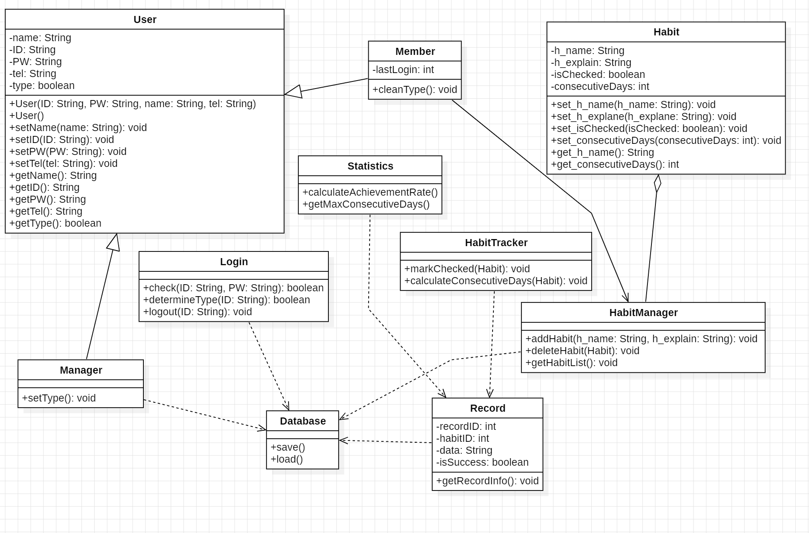

# 당신을 바꾸는 습관

# 3. Design

Student No: 22421575

Name: 신지예

E-mail: sinjiye0506@naver.com

깃허브: https://github.com/sinjiye/Habit-Tracker

## Revision history
|Revision date|Version #|Description|Author|
|:------:|:---:|:-------:|:------:|
| 6/5/2026 | 1.00 | 초안 | 신지예 |

---

## Contents

### 1. Introduction
### 2. Class diagram
### 3. Sequence diagram
### 4. State machine diagram
### 5. Implementation requirements
### 6. Glossary
### 7. References

---

## 1. Introduction

### 1) Summary

'당신을 바꾸는 습관'은 사용자가 자신의 습관을 등록하고, 수행 여부를 기록하며, 달성률과 연속 성공일을 확인할 수 있는 습관 관리 시스템이다.

본 문서는 실제 구현에 필요한 클래스 구조와 객체 간 상호작용을 설계한다. 또한 주요 가능에 대한 Sequence Diagram과 State Machine Diagram을 정의하여 구현 단계에서 일괄된 구조를 유지하도록한다.

### 2) Important Points of Design

- 사용자와 관리자의 권한을 구분한다.
- 습관 데이터와 회원 데이터를 독립적으로 관리한다.
- 모든 데이터 접근을 Database 클래스를 통해 수행된다.
- 객체지향 설계를 기반으로 기능별 클래스를 분리한다.
- 향후 가능 확장이 가능하도록 설계한다.

---

## 2. Class diagram

1) User

-ID: String

-PW: String

-name: String

+User(ID: String, PW: String, name: String) : 사용자 생성자

+setID(ID: String): void : ID를 설정

+setPW(PW: String): void : 비밀번호를 설정

+setName(name: String): void : 이름 설정

+getID(): String : ID 알려줌

+getPW(): String : 비밀번호 알려줌

+getName(): String : 이름 알려줌

2) Member

+registerHabit(name: String, description: String): void : 습관 저장

+deleteHabit(habitID: int): void : 습관 삭제

+checkHabit(habitID: int, date: String): void : 실행한 습관 체크

+viewHabitList(): List<Habit> : 습관 리스트 보여주기

+viewStatistics(habitID: int): Statistics : 습관 관련 정보 보여주기

3) Manager

+manageMember(): List<User> : 멤버 관리하기

+deleteMember(ID: String): void : 멤버 삭제하기

+searchMember(ID: String): User : 멤버 검색하기

4) Database

-userMap: Map<String, User>

-habitMap: Map<Integer, Habit>

-recordMap: Map<String, Record>

+getUser(ID: String): User

+getAllUsers(): Lsit<User>

+getHabit(habitID: int): Habit

+getRecord(habitID, date: String): Record

+getRecords(habitID: int): List<Record>

+saveUser(user: User): void

+saveHabit(habit: Habit): void

+saveRecord(record: Record): void

+deleteUser(ID: String): void

+deleteHabit(habitID: int): void

5) Login

-inputID: String

-inputPW: String

+loginCheck(ID: String, PW: String): boolean

+isManager(ID: String): boolean

+logout(): void

+registerUser(ID: String, PW: String, name: String): void

+checkID(ID: String): boolean

6) Habit

-habitID: int

-userID: String

-name: String

-description: String

-createdDate: String

+getHabitID(): int

+getName(): String

+getDescription(): String

+getCreatedDate(): String

+setName(name: String): void

+setDescription(description: String): void

7) Record

-recordID: int

-habitID: int

-date: String

-isDone: boolean

+getDate(): String

+isDone(): boolean

+setDone(done: boolean): void

8) Statistics

-habitID: int

-achievementRRate: double

-maxStreak: int

-currentStreak: int

+calculateAchievementRate(records: Lsit<Record>): double

+calculateStreak(records: List<Record>): int

+getAchievementRate(): double

+getMaxStreak(): int

+getCurrentStreak(): int

---

## 3. Sequence diagram

---

## 4. State machine diagram

---

## 5. Implementation requirements

'당신을 바꾸는 습관' 시스템을 구동하기 위해 필요한 하드웨어 및 소프트웨어 요구사항은 아래와 같다.

1) Hardware Requirements

| 항목 | 요구사항 |
|------|-------------|
|CPU|Intel Core i3 이상|
|RAM|4GB 이상|
|HDD/SSD|10GB 이상의 여유공간|
|Network|데이터베이스 연결을 위한 네트워크 환경(로컬 사용시 불필요)|

2) Software Requirements

| 항목 | 요구사항 |
|------|-------------|
|OS|Windows 10 이상 / macOS 12 이상 / Ubuntu 20.04 이상|
|Implementation Language|Python 3.10 이상|
|Database|SQLite 3(로컬 파일 기반) 또는 MySQL 8.0 이상|
|GUI Framework|tkinter(Python 기본 제공) 또는 PyQt5|

---

## 6. Glossary

| Term | Description |
|------|-------------|
| Habit | 사용자가 반복적으로 수행하려는 행동 |
| Habit Record | 특정 날짜에 수행한 습관 기록 |
| Streak | 연속으로 습관을 수행한 일수 |
| Statistics | 습관 수행 결과를 분석한 데이터 |
| User | 프로그램을 사용하는 사용자 |
| Storage | 데이터를 저장하는 시스템 |
| 메인화면 | 시스템에 처음 접속하였을 때 볼 수 있는 화면이다. 습관 리스트를 볼 수 있다. |
| 데이터베이스 | 사용자들의 회원 정보와 습관 데이터들이 저장되어 있는 곳이다. |
| Class Diagram | 객체지향형 시스템 설계에서, 시스템의 논리 설계를 위한 클래스들의 존재와 그들의 관계를 도식으로 정의한 것. 단일 클래스 다이어그램은 시스템 클래스 구조를 보여줌.|
| Sequence Diagram | 시스템의 동작을 시간 순서에 따라 객체 간의 메세지 흐름으로 표현하는 다이어그램이다.|
| State Machine Diagram | 시스템이 가질 수 있는 유한한 수의 상태와 상태 간의 전이를 표현하는 다이어그램이다.|

---

## 7. References

[Design] Example 1

[Design] Example 2

[Design] Example 3

[Design] Example 4

[Design] Example 5

[Design] Example 6

[Design] Example 7

[Design] Example 8
